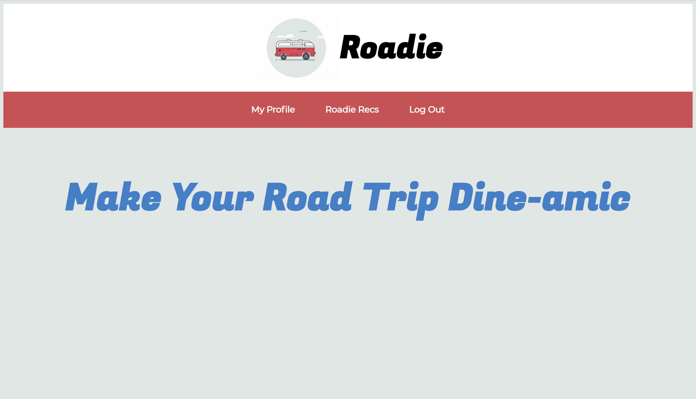

# Roadie

## Description

Roadie is a full stack application that allows users to locate diners, food joints and other lesser known rest stops while on a road trip. 

## Features

* Users can securely sign up, log in and log out of Roadie using JSON web tokens.
* Users can browse a list of 'Roadie Recs' with the name, city and state of each location.
* Users can click on each location's tile to gain access to more information about each individual Roadie Rec.
* Once on the Roadie Rec show page, users will see a photo, address, link to website, phone number, a popular menu item, find out whether it has parking, is kid-friendly and dog friendly and see the location on an embedded map.
* Users can click a button that takes them to the Google Maps UI.

## Technologies Used

* React
* React Router
* Passport
* Axios
* Google Maps

## Installation

1. Clone or downlaod this repo
2. cd into repo
3. Run npm install
4. Open a separate tab and run `npm run start` to start server

## Feature Improvements

This project is just the beginning for Roadie. With feature improvements, the application will become more intuitive and user-friendly, allowing users to gain the information they need to curate their ideal road trip:

* Users will be able to filter Roadie Recs by state and rec type, i.e., diners, food joints, breweries, etc.
* An option for Google Maps driving directions will be embedded into each Roadie Rec show page.
* Users will be able to rate each Roadie Rec, and an average of all ratings will render on the show page.
* Users will be able to earn badges based on number, types of Roadie Recs visited. These badges will appear on their user profile.
* Users will be able to edit their profile photo and information.
* Users will be able to enter their origin and destination on a map and have Roadie Recs along their route populate on the page.
